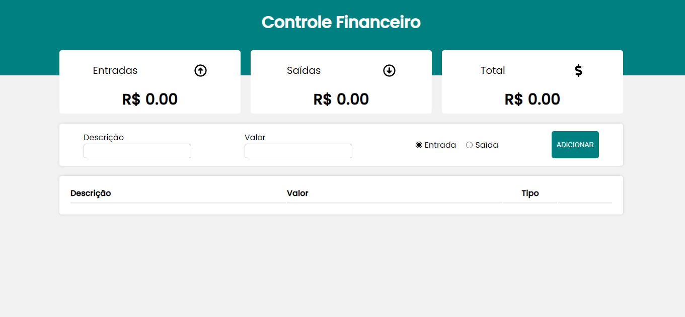

# Projeto de Controle Financeiro com React

Este é um projeto de controle financeiro desenvolvido em React, que permite ao usuário gerenciar suas finanças de forma eficiente, incluindo, excluindo e visualizando transações. O objetivo é fornecer uma aplicação simples e fácil de usar para ajudar os usuários a controlar suas despesas e receitas.

## Funcionalidades

O projeto possui os seguintes módulos:

### 1. Tela de Visualização de Transações

Nesta tela, o usuário poderá visualizar todas as transações registradas. Cada transação exibirá informações como descrição, valor, data e categoria.

### 2. Módulo de Inclusão de Transações

Neste módulo, o usuário poderá adicionar novas transações informando a descrição, valor, data e categoria. Ao adicionar uma transação, o saldo total será atualizado automaticamente.

### 3. Módulo de Exclusão de Transações

Com este módulo, o usuário poderá excluir transações específicas, o que também atualizará o saldo total.

### 4. Total de Receitas e Despesas

O projeto exibirá os totais de receitas e despesas, bem como o saldo total atual. Isso permitirá que o usuário tenha uma visão clara de suas finanças e saiba exatamente quanto está gastando e ganhando.

# Veja o resultado: 

